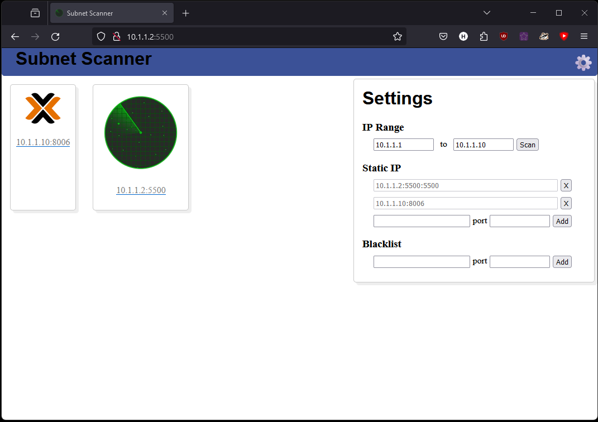

# Subnet-Scanner

I have a lot of services on my home network now, each with their own management page.

This sites purpose is to scan a set subnet range (or spesific address list) and create links to all sites on one page

## Plan

~~There's not much to this so ill just use bullet points of the main components instead of a map~~

Originally I planned on making this a client side application, however, I have run into a dead end with client side fetch requests running into cors issues so i can detect sites/services but i cant actully get an index page.

I have also greatly underestimated JS performance and this program is memery heavy and proccess intensive.

The plan now is to move the site to a server side backend running on a LXC proxmox container on my home server, and a front end that simply caches setttings, tiles and requests the server for info.

V1

#### WebGUI Interface

* [X] Hosted by server (Will probably add a webroute on my PiHole LXC)
* [X] Basic scaleable layout, just a page with a settings button and tiles for each discovered address

#### Configurable settings (Cached to browser)

* [X] Select IP range x.x.x.x - x.x.x.x
* [X] Select Spesific IP and optional port
* [X] Blacklisted IP's
  (Might add a blacklist button to tiles, not really needed for my uses)

#### Storage

* [X] Get and Store Settings to browser cache

#### Scanner

* [X] Ping a range of input IP addresses on all ports
* [ ] Fetch detected sites Index Page

#### Tiler

* [X] Use Input index page to grab site tilte and favicon
* [X] Push new site tile to web GUI (showing Favicon, Title and address)

##### Extra

* [X] Add tiles to storage
  * [ ] Add live "up" and "down" connection indicators to tiles
* [ ] Add restrictions to inputs
  * [ ] Input must be valid ip or port
  * [ ] input 1 must be smaller than input 2
* [ ] Add buttons to Tiles
  * [ ] Remove
  * [ ] Blacklist
* [ ] Add Ports to settings
  * [ ] Port Range
  * [ ] Port Blacklist
  * [ ] Port Range Blacklist
* [ ] Make JS Async (no need but why not)

## Notes

To start editing

* Start LiveServer, Host IP is http://10.1.1.2:5500/index.html
* Start Sass, sass --watch input.scss styles.css
* Try not to procrastonate

V2

